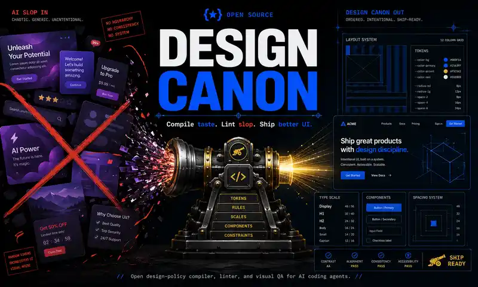

<p align="center">
  
</p>

<p align="center">
  <a href="https://x.com/tonysimons_"></a>
  <a href="https://github.com/asimons81/design-canon/actions/workflows/test.yml"></a>
  <a href="LICENSE"></a>
  
  
</p>

<h1 align="center">Design Canon</h1>

<p align="center"><strong>Stop shipping the model's favorite UI.</strong></p>

Design Canon is an open design-policy compiler, linter, and visual-QA project for AI coding agents. It turns a structured catalog of contextual design rules into compact instructions for the interface you are actually building, then checks the result for detectable violations.

It is not an 800,000-character prompt brick. It is a versioned system.

## Watch the Launch Film

[](https://youtu.be/kmndi7eyEnc)

**Design Canon turns generic AI-generated interface defaults into scoped, testable, versioned design policy.**

## Why

AI agents can generate polished frontend code quickly, but they often converge on the same defaults: centered hero stacks, purple gradients, giant rounded cards, decorative shadows, generic copy, weak focus states, and motion sprayed everywhere.

A giant markdown file can nudge the model, but it creates four new problems:

- irrelevant context consumes tokens and dilutes important rules
- universal bans confuse taste with dogma
- prose rules cannot prove they were followed
- the system cannot learn from explicit user preferences

Design Canon separates rules, profiles, compilation, linting, visual review, and taste memory.

## Working Alpha

The repository already includes:

- atomic, scoped design rules with rationale and verification
- profiles for marketing pages, product applications, and editorial layouts
- compilation to `DESIGN.md`, `SKILL.md`, or general agent instructions
- a zero-runtime-dependency linter for mechanical heuristics
- project-local, rationale-required suppressions that preserve evidence
- an installable Agent Skill for Codex, Hermes Agent, Claude Code, Cursor, and compatible tools
- tests and an intentionally terrible example fixture

## Quick Start

```bash
git clone https://github.com/asimons81/design-canon.git
cd design-canon
npm test

node ./bin/design-canon.js compile \
  --profile marketing \
  --target design \
  --output DESIGN.md

node ./bin/design-canon.js lint ./src --profile marketing
```

Available profiles:

```bash
node ./bin/design-canon.js profiles
```

## Justified Exceptions

Design Canon does not confuse a detector with an aesthetic law. Projects can suppress a finding only through an explicit, scoped rationale in `design-canon.config.json`:

```json
{
  "$schema": "./schema/config.schema.json",
  "version": 1,
  "profile": "marketing",
  "suppressions": [
    {
      "rule": "color.purple-gradient-default",
      "files": ["src/brand/**/*.css"],
      "reason": "Purple is the documented primary brand color for this campaign.",
      "approvedBy": "design-systems",
      "expires": "2099-12-31"
    }
  ]
}
```

```bash
node ./bin/design-canon.js lint . \
  --config design-canon.config.json \
  --format json
```

Expired, unknown, duplicated, absolute, or path-escaping suppressions fail closed. Suppressed findings remain in the JSON report with their evidence and rationale. Unused suppressions are reported for cleanup.

See [`docs/CONFIGURATION.md`](docs/CONFIGURATION.md) for the complete contract.

## The Upgrade

| Prompt bundle | Design Canon |
|---|---|
| One enormous context file | Compiles only relevant rules |
| Blanket style bans | Contextual profiles and overrides |
| Advice only | Static lint plus planned visual evidence |
| No verification contract | Every rule can define checks |
| Same taste for everyone | Planned project-local preference memory |
| Unclear provenance | Versioned, reviewable, open rule packs |
| “Looks better” claims | Planned paired benchmarks |

## Repository Map

```text
bin/                    CLI entry point
src/                    compiler, selector, and linter
rules/                  atomic design-policy catalog
profiles/               surface-specific rule selection
schema/                 open JSON schemas
skills/design-canon/    portable Agent Skill
examples/sloppy/        violation fixture
tests/                  regression tests
docs/ARCHITECTURE.md    system design
docs/CONFIGURATION.md   configuration and suppression contract
ROADMAP.md              path to visual QA, benchmarks, and taste memory
```

## Philosophy

Gradients are not illegal. Shadows are not illegal. Inter is not illegal. Cards are not illegal.

**Unexamined defaults are the enemy.**

A detector creates a review obligation, not an automatic aesthetic verdict. The final authority remains the person shipping the interface.

## Clean-Room Notice

Design Canon is an independent clean-room implementation based on public product behavior, open design standards, and original rules. Do not submit copied proprietary prompt files or unlicensed branded design systems.

## License

MIT
